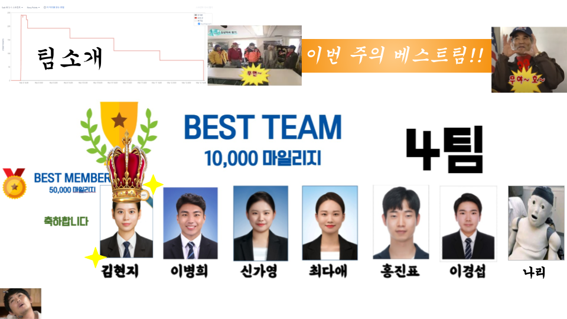

## 홀로 어르신과 가족들을 이어주는 다리, 잇다👨‍👧‍👦

- 홀로 어르신의 정신, 인지, 생활 건강을 책임지는 감성 돌봄 AIoT
- 홀로 어르신의 일상, 건강상태, 추억을 가족들에게 공유할 수 있는 서비스

## `나`와 가족을 잇는 다`리`가 되어주는, 대표 캐릭터 나리🌻

- 홀로 어르신이 음성 인식 기반 서비스를 쉽게 사용할 수 있도록 대표 캐릭터 설정
- 발음 시 혼동이 없고 부르기 편하도록 나리라는 이름 부여

## 서비스 대상

- 홀로 어르신: 기본적인 TV 사용법을 인지하고 있는 시니어 1인 가구
- 홀로 어르신을 둔 가족

## 404 All Found 소개

- `김현지`: 팀장, Front-end
- `이병희`: AI 설계, Back-end
- `신가영`: Front-end
- `최다애`: AI 설계, Back-end
- `홍진표`: AI 설계, Front-end
- `이경섭`: AI 설계, IoT