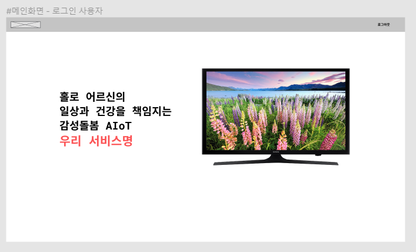
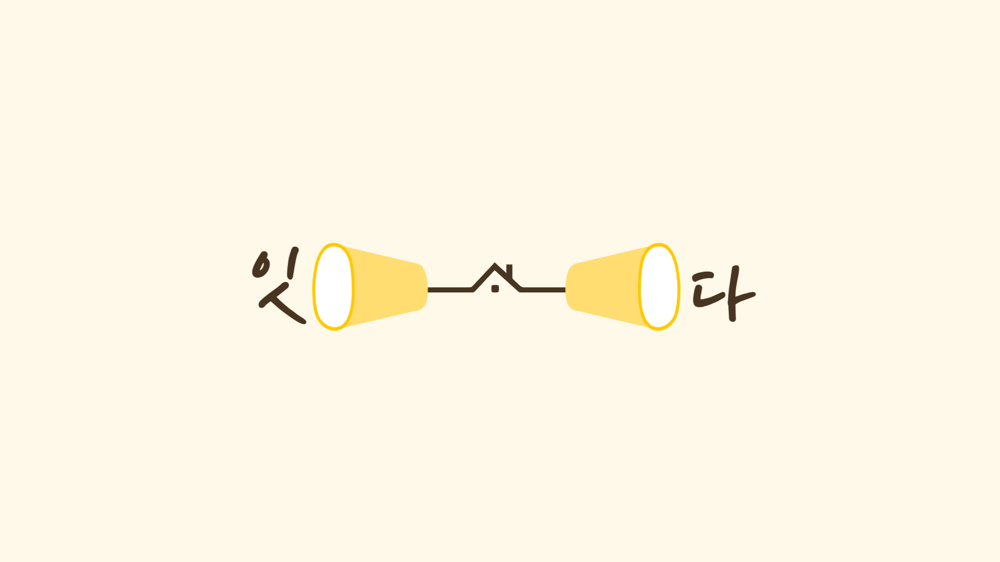
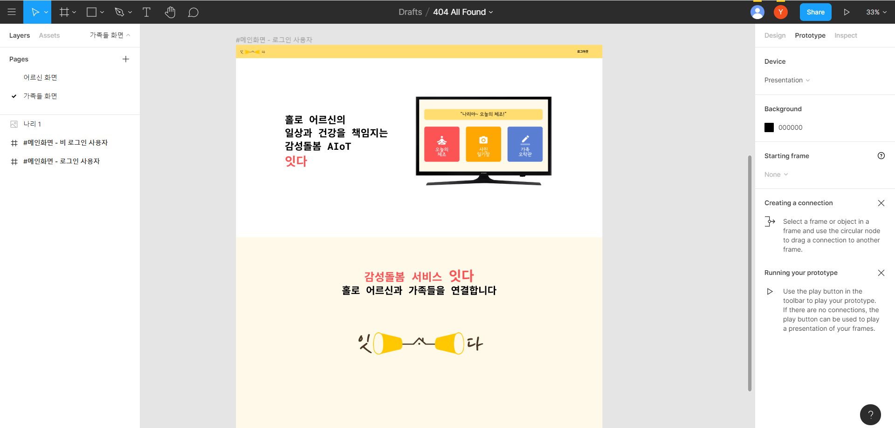
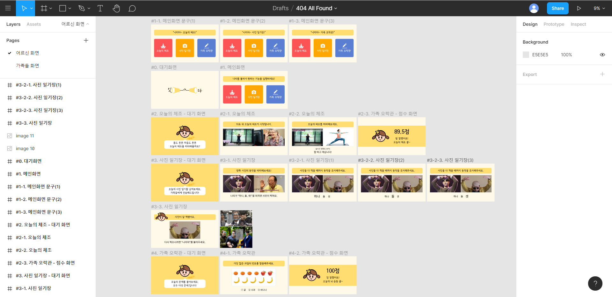
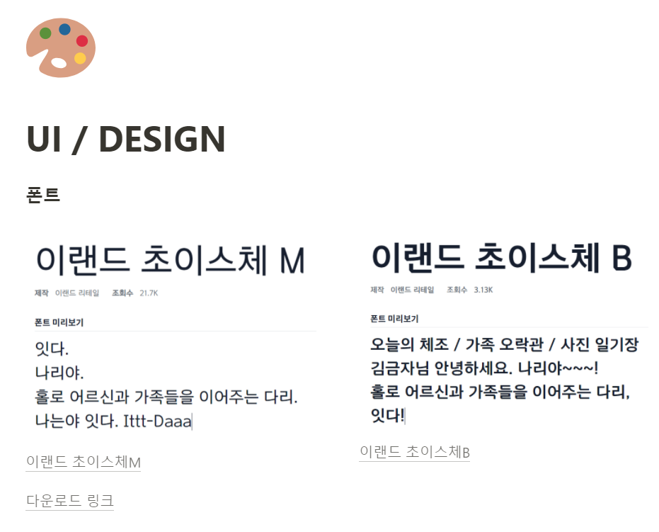
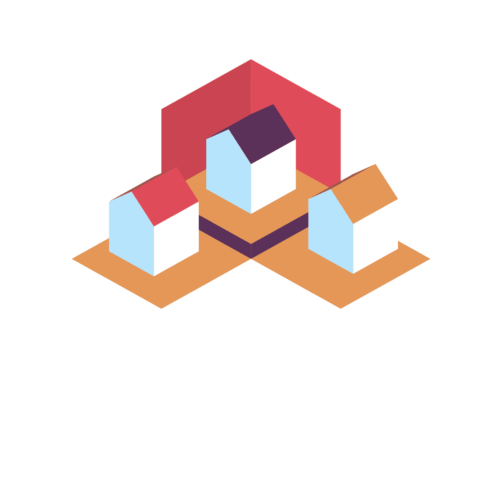

## 2021. 03. 11. git-cz

### git-cz란? commit 자동화 라이브러리

[git-cz](https://www.npmjs.com/package/git-cz)


이 라이브러리를 사용하면 커밋 메세지를 예쁘게 관리할 수 있습니다!


### 설치 방법

1. -g 옵션으로 global 하게 설치

```jsx
npm install -g git-cz
```

**주의**: git bash에서는 조작이 안될 수도 있으니 CMD나 VSC 내의 터미널 사용을 권장합니다!

1. 프로젝트에 `changelog.config.js` 파일 작성하여 커스텀
2. 커밋할 때 git commit 대신 git cz 명령어를 써주면 형식에 맞춰 커밋이 가능


## 2021. 03. 12. 라즈베리파이 도입

### 라즈베리파이란?

라즈베리파이(영어: Raspberry Pi)는 영국 잉글랜드의 라즈베리파이 재단이 학교와 개발도상국에서 기초 컴퓨터 과학의 교육을 증진시키기 위해 개발한 신용카드 크기의 싱글 보드 컴퓨터이다.


### 우리 프로젝트에 임베디드(라즈베리파이)를 도입한다면?

라즈베리파이도 결국 컴퓨터니까 컴퓨터에 크롬을 넣는다.
공통프로젝트 때처럼 웹사이트는 Vue.js / React를 이용하여 개발한 뒤, AWS로 배포한다.
이를 통해 라즈베리파이와 우리가 그린 화면을 연결할 수 있다.
노트북 모니터 대신 TV가 화면이 될 뿐이다!


## 2021. 03. 16. FE: 와이어프레임 제작 단계




궁금한 점

- TV 소유자와 가족들 계정을 어떻게 연결할 수 있을까요?
- 유튜브 영상이 끝났음을 알 수 있는 방법이 있나요?


논의해야할 부분

- 이전 단계로 돌아가기, 메인 화면으로 가기 어떻게 음성으로 구현할까요?
- 가족오락관에서 3지선다로만 문제를 출제한다면, 다섯 문제 풀고 난 이후에 정답률 계산할 수 있을까요?


## 2021. 03. 18. FE: 서비스명 확정 및 와이어프레임 제작



#### 서비스명: `잇다` (홀로 어르신과 가족들을 잇는다는 의미)


#### 캐릭터명: `나리` ('나'와 가족을 잇는 다'리'라는 의미)


#### 와이어프레임 - 어르신 화면 제작 (진행 중)




#### 와이어프레임 - 가족들 화면 제작 (진행 중)


## 2021. 03. 19. FE: 와이어프레임 결과 화면 추가 및 발표 준비



- 오늘의 체조와 가족 오락관 메뉴의 점수 화면을 추가했다.
- 오늘 발표가 끝나고 [노인을 위한 웹 디자인](https://brunch.co.kr/@mrlees/10)이라는 브런치 글을 읽게 되었는데, 우리 어르신들 화면 구성에 대해 다시 생각해보는 계기가 되었다. 그래서 오늘은 B TV 화면 구성도 유심히 살펴봤다.
- [사진을 적재적소에 활용한 사이트](https://www.discovery.co.za/portal/)를 참고하여 메뉴를 다시 구성해보고 싶은 욕심이 생긴다.


- 1차 발표 무사히 완료!
- 다음 주부터는 개발 속도를 확 높여야겠다는 생각이 든다 ... 🧨 우리 팀 화이팅...!


## 2021. 03. 22. TIL (feat. Today I Felt🤨)

#### 지난 주 발표에 대한 아쉬움

지난 주 발표에 대한 다른 팀들의 피드백을 받아봤는데, 솔직히 당황스러웠다.
왜냐하면 **아쉬운 점을 작성한 피드백의 절반 이상이 우리 발표를 제대로 안 듣고 쓴 듯한 내용이었기 때문**이다.
가령, 우리 서비스는 어르신들 전용 어플리케이션이 아님에도 노인 스마트폰 보급률 혹은 활용 미숙에 대해 언급했다든지,
어르신용 웹 사이트가 없음에도 웹으로 제공하는 서비스라고 착각했다든지,
가족들용 서비스가 이미 존재함에도 손자, 자식용 서비스도 만들어달라는 내용이었다.
단순 잔디심기를 위한 커밋처럼, 제출을 위해 쥐어짜낸 피드백인가 싶었다.
다른 팀이 느낀 아쉬운 점들을 보완해보고자 하는 의지가 있었던 우리 팀으로서는 오히려 반영할만한 피드백이 적음에 더 아쉬웠다.

하지만 이 모든 것이 우리 발표에 집중하지 않은 다른 교육생들의 탓만이라고는 생각하지 않는다.
어쩌면 **우리 발표의 흐름이 사람들을 집중시킬만큼 흡인력이 부족했다는 반증**일지도 모르겠다.
(이 부분은 발표자의 발표력과는 무관하다. 우리 팀 발표자의 발표력은 흠 잡을 곳 없었다. 다만, 우리 팀 발표의 지향점이 아쉬웠다는 뜻이다.)

그리하여 아쉬운 마음을 담아 몇 몇 부분은 보완하고, 또 스스로 답을 내보려 한다.
**모든 피드백을 받아들일 필요는 없으니까. 반영할 점은 반영하고, 반영하지 않아도 될 부분은 쿨하게 패스하기!**


#### 반영할 점 or 답할 말이 있는 피드백들

1. 시장성 조사가 부족해보였다.
   -> 사실 시장성 조사는 기획 단계에서 충분히 수행했고, 이미 끝난 상태다. SKT의 AI 스피커 아리아, AI 반려로봇 부모사랑 효돌, 노인 돌봄 AI 로봇 다솜이 등. 그럼에도 굳이 발표에 넣지 않은 것은 `노인` `돌봄` `AI`라는 키워드가 겹치는 만큼 우리 팀에 불리하게 작용할까 하는 우려 때문이었다. 하지만 우리 기획은 **`TV`가 매개체가 된다**는 점과 **가족들과의 `연결`이 주된 주제**라는 점에서 기존 서비스들과 차별성을 둔다. 따라서 앞으로 발표할 때는 괜한 우려를 내려놓고 발표해도 될 것 같다.
2. TV에 연결된 화면이라면 스마트TV를 말하는 것인가?
   -> 스마트 TV가 아닌 일반 TV로도 가능하다. **어떤 방식으로 연결되는지**, 그 원리는 우리가 분명하게 짚고 넘어가는 편이 좋겠다.
3. 가족 오락관 기능을 어르신들이 사용할지 의문이다.
   -> 가족들이 직접 문제를 출제한다는 데에 그 의의가 있다. 단순 문제가 아닌 가족들이 애정을 담아 출제한 문제이자, 추억이 담긴 문제이기 때문이다. 이 부분은 **가족과의 연결이라는 키워드를 강조**하면 해결될 문제라고 생각한다.
4. 노인층을 위한 서비스인데 구체적으로 어떻게 구현할지 이해가 되지 않았다. & 개발이 얼마나 됐는지 파악이 힘들었다.
   -> 이번 발표 주제는 기획에 초점을 맞췄고, 우리는 기술적인 부분을 발표하지 않았으니 어쩌면 당연한 피드백이다. 이건 지켜보면 해답이 나올 거란 답 밖엔 할 수 없겠다. 실제로 구현되면 발표할 예정이다.


#### "Think outside the box!"

*주제와 달리 발표내용이 좀 가벼워 보였다. 노인문제를 너무 쉽게 본것은 아닌지?*

-> 이 피드백을 한 사람에게 역으로 묻고 싶다. 그렇다면 노인 문제는 **너무 어렵게** 봐야 하는가?
우리 사회는 각종 사회·문화·환경 문제를 어렵게, 진지하게 보려는 경향이 존재한다. 때로는 일종의 불행 포르노처럼 느껴져 불쾌할 때도 있다. 나는 이 틀을 깨고 싶다. 우리 사회를 둘러싼 각종 이슈들을 범접하기 어려운 것으로 치부한 뒤 한발짝 뒤로 물러서는 건 너무 비겁하지 아니한가. 사회 문제를 나와는 무관한 것으로, 혹은 시혜적인 태도로 바라보는 것을 멈추고 싶다. 적어도 우리 서비스 안에서라도.


#### 늙은 것도 서러운데 디자인에서도 찬밥신세라니...


출처: [노인을 위한 웹 디자인](https://brunch.co.kr/@mrlees/10)


할머니, 할아버지를 생각하면 바로 떠오르는 고정 관념들. 우리 서비스는 그걸 와장창 깨버리는 서비스였으면 한다.

> 우리 할머니는 40년 째 수영을 하고 계시고, 요즘 들어 새로 생긴 취미는 칼림바 연주이다. 음식은 크림스파게티를 좋아하시고, 최근에 빠진 음료는 바닐라 라떼. 카카오톡 답장은 나보다도 빠르신 편이다. 나는 네이버 스마트렌즈 기능을 할머니께 배웠다.

세상에는 이런 할머니도 있다. 그리고 우리 할머니 역시 서비스의 대상자이시다.
대부분의 어르신들이 몰라서 못하고, 몰라서 못 즐기는 것 뿐인데 **우리는 노인 취향을 너무 단편적으로 판단하지는 않는가?** 하는 의문을 항상 품고 산다. 주변에 친절히 가르쳐주고 알려주는 사람 단 한 명만 있어도 당신의 취향을 마음껏 향유할 수 있을텐데 하는 아쉬움과 함께.

지난 주에 노인을 위한 웹 디자인이라는 글을 읽으며 많은 생각이 들었기에, 오늘 시니어 웹 디자인, 시니어 UI/UX 기획에 대한 자료들을 몇 가지 찾아봤다. 그리고 내가 내린 결론은, **우리 눈에 예쁜 것이 어른들 눈에도 예쁘다**는 것. 대신, 노안에 대한 고려나 나이에 따른 차이는 절대 잊지 말 것!! **세심한, 섬세한 디자인**을 해보자.


#### Reference


가족들 화면 구성으로 찾은 레퍼런스. 사진을 활용하고 싶었던 우리에게 아주 적합한 레퍼런스가 아닌가 싶다.


#### 어르신 화면 - 와이어프레임 수정


레퍼런스와 비슷하게 어르신들 화면도 바꿔보았는데, 아직은 손 볼 부분이 더 많다.
특히 폰트! 내일 우리 서비스에 잘 어울릴만한 폰트를 확정해야겠다.


## 2021. 03. 23. 폰트 및 로고 선정






새로운 로고는 1번으로 결정, 탕탕🥨 