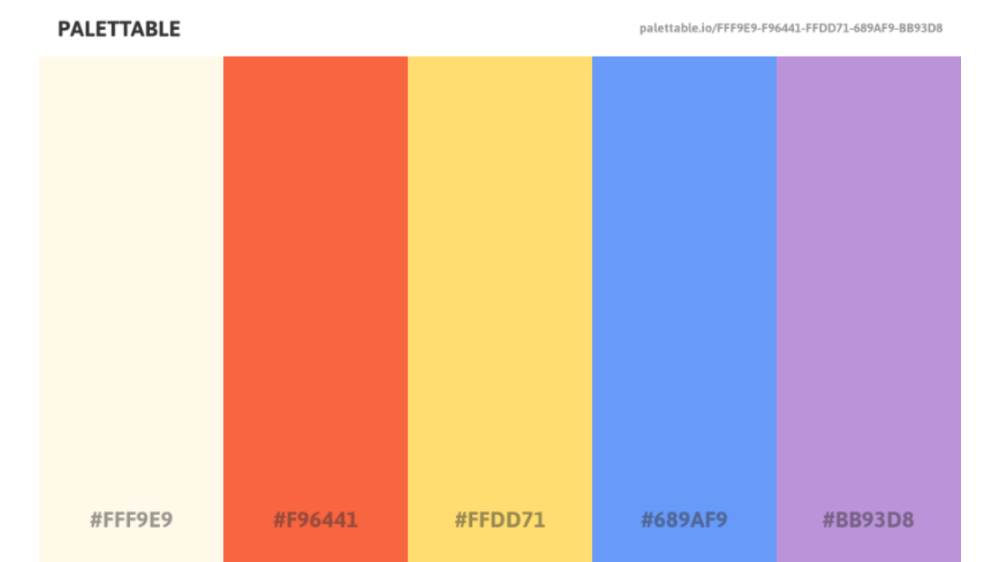
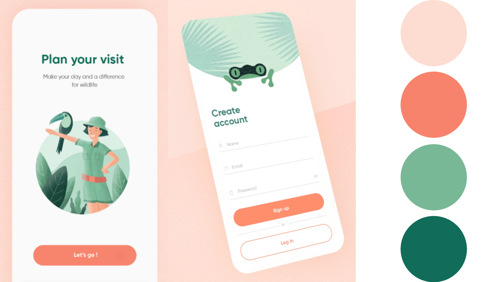
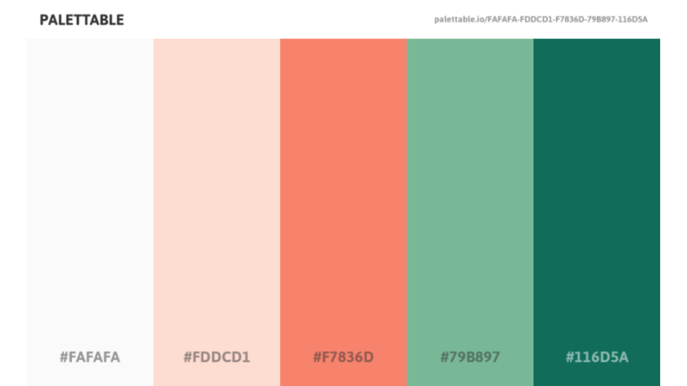
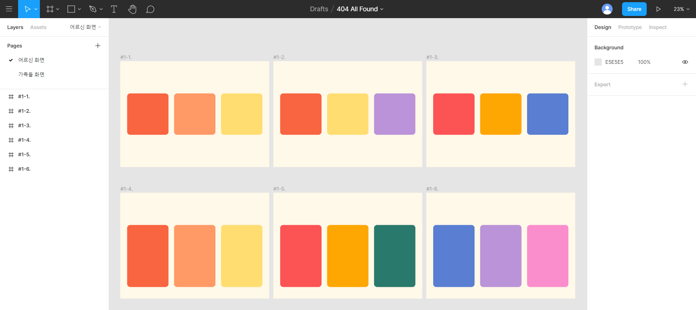

# UI / Design

> 2021.03.15. FE `김현지` & `신가영`
>
> 디자인 레퍼런스 찾은 뒤 Main Color Palette 선정

### # UI / Design 설계 시 고려사항🎨

- 어르신들이 보는 건 `TV 화면`임을 잊지 말기

  -> 배경으로 흰 색을 사용하면 너무 밝아서 눈이 피로할 수 있다.

- 어르신들이 주로 좋아할만한 `색상`이 무엇인지 생각해보기

  -> 나이가 들수록 화사한 색이 좋아진다는 할머니의 의견

- 어르신들 화면 구성을 우선적으로 고려하여 디자인 컨셉을 선정하고, 이를 가족들 전용 웹사이트에도 적용한다.
  -> 이렇게 서비스의 `톤앤매너`를 맞춘다.

### #1. 봄 느낌의 밝은 파스텔톤🏡

### #2. 톤 다운, 차분한 가을 느낌🍂

### #3. 원색을 포인트 컬러로🍊

### #4. 분홍색과 초록색의 조화🦩

### #5. 컬러풀, 무지개 느낌🌈

### MatterMost 채널을 통한 투표 결과

후보 5번이 가장 많은 표 획득!

### 다양한 컬러를 조합하여 Figma에서 그려본 메인 화면 

앞으로 와이어프레임 그리면서 고려할 점

- `색상 조합`: 각 기능들과 포인트 컬러가 잘 어우러지는가?

- `블록 모양`: 정방형 vs 세로형?
- `corner radius`: 적당히 둥글게? 더 둥글게?